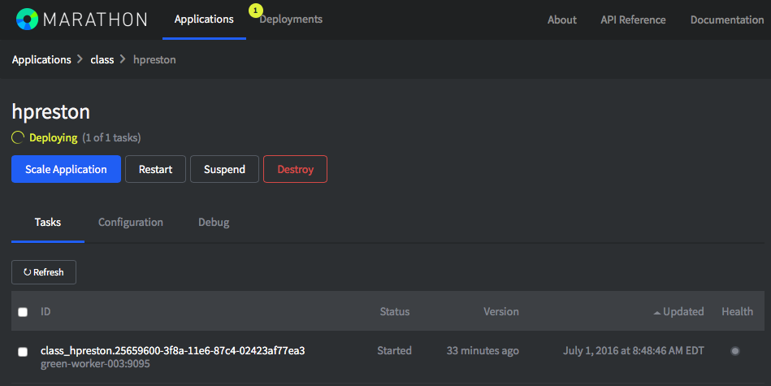

## Install your application

Now that we have used CICD to automate the creation of a Docker container for our application, we can now deploy our application.  This step could certainly be automated as well, but in this lab we will manually install our application and rely on automation to keep it up to date.

## Investigate the installation process

1. Included in your repository are three files that are used to define, install, and uninstall the application.
    * [sample-demoapp.json](https://github.com/hpreston/cicd_demoapp/blob/master/sample-demoapp.json) is a template for the Marathon Application definition that will be used.  A custom version will be created at installation that references **YOUR** Docker container.
    * [app_install.sh](https://github.com/hpreston/cicd_demoapp/blob/master/app_install.sh) is a bash script that installs the demoapp.  This has three steps.
        1. Collect environment details: Lab Mantl Address, Lab Username, Lab Password, Your Docker Username, and the Lab Application Domain
        2. Create an application definition for your deployment
        3. Install your application using the REST API for Marathon.
    * [app_uninstall.sh](https://github.com/hpreston/cicd_demoapp/blob/master/app_uninstall.sh) is a bash script that uninstalls the demoapp.  This has two steps.
        1. Collect environment details: Lab Mantl Address, Lab Username, Lab Password, and Your Docker Username
        2. Destroy your application using the REST API for Marathon.
2. You could manually install the application using the Marathon GUI, however the GUI lacks the ability to configure certain parameters we need for the lab.  Also, deploying through APIs is so much cooler!

## Install your application

From the root of your code repository...

1. Execute the installation script.
    ```
    $ ./app_install.sh

    # You will be prompted to enter the information needed before the applicaiton deploys.
    # The process will look like this

    Please provide the following details on your lab environment.

    What is the address of your Mantl Control Server?
    eg: control.mantl.internet.com
    control.mantl.domain.com

    What is the username for your Mantl account?
    admin

    What is the password for your Mantl account?
    **HIDDEN**

    What is the your Docker Username?
    hpreston

    What is the Lab Application Domain?
    mantl.domain.com


    ***************************************************
    Installing the demoapp as  class/hpreston
      % Total    % Received % Xferd  Average Speed   Time    Time     Time  Current
                                     Dload  Upload   Total   Spent    Left  Speed
    100  1508    0   997  100   511   1643    842 --:--:-- --:--:-- --:--:--  1642
    {
        "acceptedResourceRoles": null,
        "args": null,
        "backoffFactor": 1.15,
        "backoffSeconds": 1,
        "cmd": null,
        "constraints": [],
        "container": {
            "docker": {
                "forcePullImage": true,
                "image": "hpreston/cicd_demoapp:latest",
                "network": "BRIDGE",
                "parameters": [],
                "portMappings": [
                    {
                        "containerPort": 5000,
                        "hostPort": 0,
                        "protocol": "tcp",
                        "servicePort": 0
                    }
                ],
                "privileged": false
            },
            "type": "DOCKER",
            "volumes": []
        },
        "cpus": 0.1,
        "dependencies": [],
        "deployments": [
            {
                "id": "7e659013-3b2e-4446-954e-2405c3ebc865"
            }
        ],
        "disk": 0,
        "env": {},
        "executor": "",
        "healthChecks": [
            {
                "gracePeriodSeconds": 300,
                "ignoreHttp1xx": false,
                "intervalSeconds": 60,
                "maxConsecutiveFailures": 3,
                "portIndex": 0,
                "protocol": "TCP",
                "timeoutSeconds": 20
            }
        ],
        "id": "/class/hpreston",
        "instances": 1,
        "labels": {},
        "maxLaunchDelaySeconds": 3600,
        "mem": 16,
        "ports": [
            0
        ],
        "requirePorts": false,
        "storeUrls": [],
        "tasks": [],
        "tasksHealthy": 0,
        "tasksRunning": 0,
        "tasksStaged": 0,
        "tasksUnhealthy": 0,
        "upgradeStrategy": {
            "maximumOverCapacity": 1,
            "minimumHealthCapacity": 1
        },
        "uris": [],
        "user": null,
        "version": "2016-07-01T12:45:10.685Z"
    }
    ***************************************************

    Installed
    Wait 2-3 minutes for the service to deploy.
    Then you can visit your application at:

    http://class-hpreston.mantl.domain.com/hello/world


    You can also watch the progress from the GUI at:

    https://control.mantl.domain.com/marathon
    ```

2. The application is now being deployed, and you can watch the progress from the lab console address (provided by the lab admin).

    

3. Once the application is fully deployed (shouldn't take more than 3 minutes), and show's healthy in the console, you can visit your applicaiton at the URL that was provided at the end of installation.

    


## Current Build Pipeline Status

Okay, so building on the process from the previous step, this diagram shows what we've added.


1. You committed and pushed code to GitHub.com
2. GitHub sent a WebHook to the drone server notifying it of the commit.
3. Drone checks the _.drone.yml_ file and executes the commands in teh _build_ phase.
  * As part of this phase, drone fetches a container, identified in the `image: python:2` line of the config, from hub.docker.com.  It will run the commands and tests described in this phase from this container.
  * Send a message to Spark
4. Drone checks the _.drone.yml_ file and executes the commands in the _publish_ phase.
  * Build a Docker Container using the Dockerfile within the repo
  * Push the container up to hub.docker.com using the credentials in the secrets file
5. With the new container available in Docker Hub, you manually installed the application to Marathon.
  * Marathon pulled the container directly from Docker Hub.

## Next Step!

Time to move onto the next step.

5. [Stage 3 - Continuous Deployment](cicd_stage_3.md)


