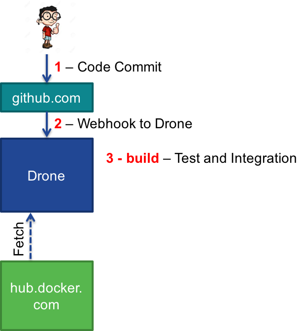

# CICD Stage 1: Continuous Integration

The first step of the CICD process is to react to new code commits and test the changes against the larger application needs.  In this lab, we will configure drone to send an alert to our Spark room each time a commit has been made.

## Update the .drone.yml configuration

In the root of the code repository is a file _.drone.yml_ that provides the instructions to drone on what actions to take upon each run.  We will be updating this file at each stage of the lab to move from Continuous Integration -> Delivery -> Deployment.

1. Open the _.drone.yml_ file in your editor.  The file should start looking like this.  The _build_ directive at the top represents where the integration phase of the process will take place.  In the _commands:_ list are the different steps needed to validate a successful code change.  Currently nothing is being done, _env_ is simply a placeholder command to display all current environment variables in the build container.
    ```
    build:
      image: python:2
      commands:
        - env
    ```
2. Add a new line to the file that will send an informational notice to the Spark room (identified by the roomId stored in the secrets file) that a new build has started.  This command uses curl to send an API call to Cisco Spark.  Within the command we reference the variables in the secrets file with **$$SPARK_TOKEN** reference.
    ```
    build:
      image: python:2
      commands:
        - env
        - curl https://api.ciscospark.com/v1/messages -X POST -H "Authorization:Bearer $$SPARK_TOKEN" --data "roomId=$$SPARK_ROOM" --data "text=Drone kicking off build $CI_BUILD_NUMBER"
    ```
3. As part of the security of drone, every chance to the _.drone.yml_ file requires the secrets file to be recreated.  Sense we've updated this file, we need to resecure our secrets.
    ```
    # Replace USERNAME with your GitHub username
    drone secure --repo USERNAME/cicd_demoapp --in drone_secrets.yml
    ```
4. Now commit and push the changes to the drone configuraiton and secrets file to GitHub.
    ```
    # add the file to the git repo
    git add .drone.sec
    git add .drone.yml

    # commit the change
    git commit -m "Updated Build Phase to notify with Spark"

    # push changes to GitHub
    git push
    ```
5. Now check the Drone web interface, and a new build should have kicked off.  And watch for the Spark message to come through in the client.

    

6. Click on the build and scroll through the log displayed.  You can use this log to monitor the process in each stage as we add additional steps to the build process.

    

7. If the build reports a **Failure**, or the Spark message never comes, check the log to see what might have gone wrong.  Common reasons include forgetting to re-create the secrets file, forgetting to commit the secrets file after recreating, or mis-entered credentials in the plain text secrets file.

## Current Build Pipeline Status

Okay, so drone said it did something and we got a Spark message... what actually happened.  This image and walkthrough shows the steps that are occuring along the way.



1. You committed and pushed code to GitHub.com
2. GitHub sent a WebHook to the drone server notifying it of the commit.
3. Drone checks the _.drone.yml_ file and executes the commands in teh _build_ phase.
  * As part of this phase, drone fetches a container, identified in the `image: python:2` line of the config, from hub.docker.com.  It will run the commands and tests described in this phase from this container.
  * Send a message to Spark